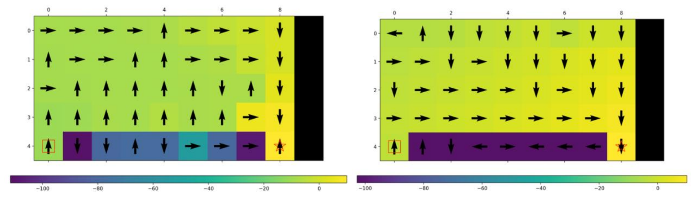

# Comparative Study of Reinforcement Learning Algorithms in Custom Grid Worlds
## Overview
This project implements and compares several core **Reinforcement Learning (RL)** algorithms for policy optimisation across multiple grid-based environments:  
- Dynamic programming methods: **Value Iteration (VI)**, **Policy Iteration (PI)**, **Asynchronous Value Iteration (AVI)**  
- Temporal-difference learning methods: **SARSA**, **Expected SARSA**, and **Q-Learning**

The experiments analyse **convergence efficiency**, **parameter sensitivity**, and **policy robustness** in different worlds.  

  
   
  <em>Policies by SARSA (left) and Q-Learning (right)</em>

##  Code Structure

| File | Description |
|------|--------------|
| `gridworld.py` | Environment definition for *small world*, *cliff world*, and *grid world* setups. |
| `value_iteration.py` | Implements synchronous and asynchronous Value Iteration. |
| `policy_iteration.py` | Implements Policy Iteration with evaluation and improvement steps. |
| `sarsa.py` | On-policy SARSA agent with ε-greedy exploration. |
| `expected_sarsa.py` | Expected SARSA algorithm considering the expected Q-value. |
| `q_learning.py` | Off-policy Q-Learning implementation. |
| `utils.py` | Helper functions for plotting, evaluation, and convergence visualisation. |

## Key Takeaways

- **Policy Iteration** converges fastest but requires full policy evaluation.  
- **Asynchronous VI** achieves near-optimal results with fewer updates.  
- **Expected SARSA** offers smoother and faster convergence than SARSA.  
- **Q-Learning** is efficient but risk-prone; **SARSA** is safer in dynamic worlds.  

